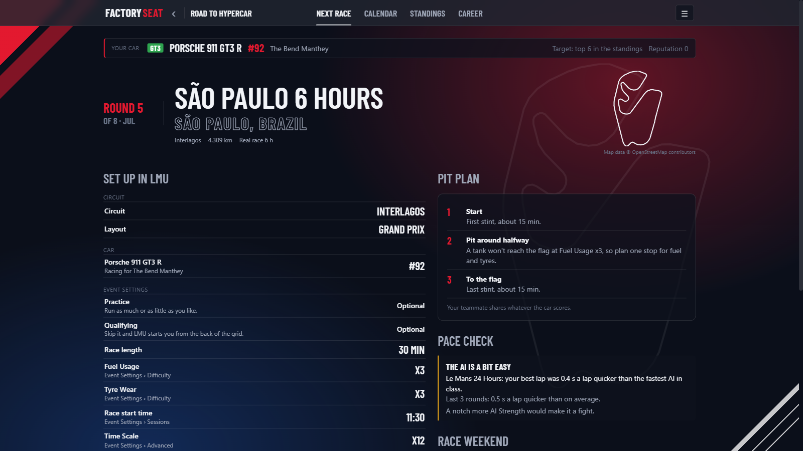
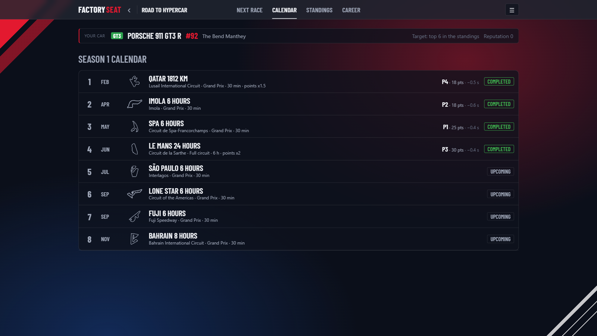
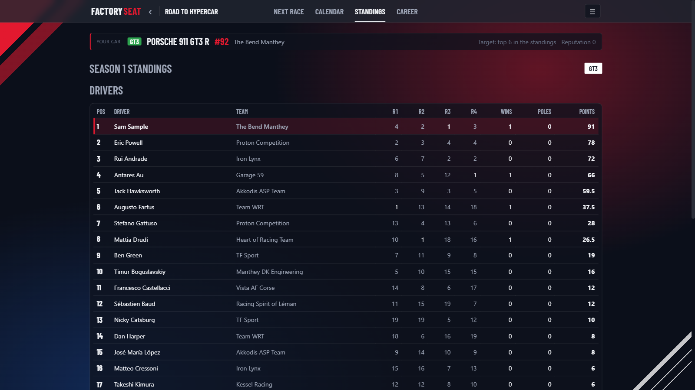
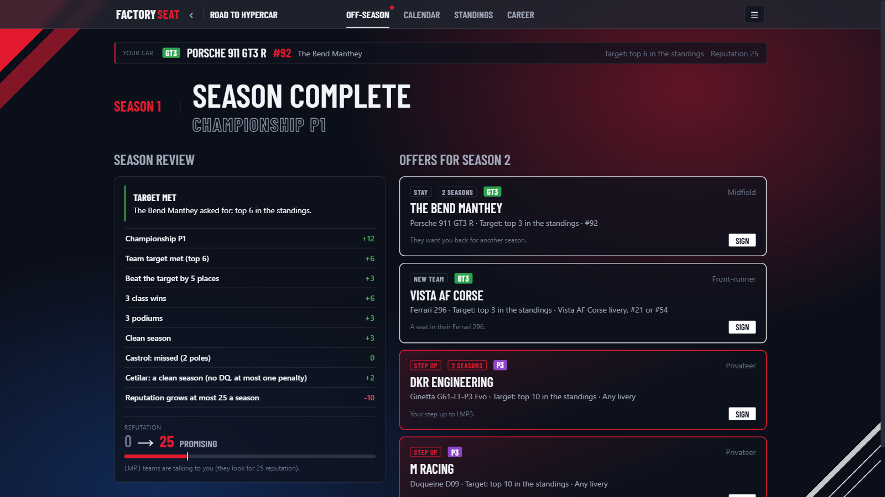

# Factory Seat

**A career mode for Le Mans Ultimate.** Free and unofficial.

Start as an LMGT3 rookie and race your way up through LMP3 and LMP2 to a factory Hypercar seat, one season at a time. You race in Le Mans Ultimate as usual. Factory Seat gives you each race weekend's briefing, picks up your results when you finish, and runs the championship, your reputation, sponsors and the team offers between seasons.

> Factory Seat is a fan project. It is not affiliated with, endorsed by or connected to Studio 397, Motorsport Games, the ACO, the FIA WEC or IMSA.



| Season calendar | Championship standings | Off-season offers |
| :---: | :---: | :---: |
| [](docs/screenshots/calendar.png) | [](docs/screenshots/standings.png) | [](docs/screenshots/off-season.png) |

## Features

- **Multi-season careers.** LMGT3 → LMP3 → LMP2 → Hypercar. You only move up when a team offers you a seat.
- **Season builder.** A default world or European calendar for your class, with every race's length adjustable and events you can add, reorder or make up yourself.
- **Race briefings** in LMU's own setting names: track and layout, race length, Time Scale, Fuel Usage, Tyre Wear and start time, plus a pit plan.
- **Automatic results.** Leave the app open while you race. It watches LMU's results folder and pops up when the race ends. Only races that match the briefing count, so test drives and online races never do.
- **Championship standings** for every class, with WEC-style points, double points at the 24-hour races, and pole points.
- **Reputation and team offers.** Results against your team's target, wins, clean racing and big-event wins build your reputation. Better teams call as it grows, and big wins get you noticed mid-season.
- **Sponsors.** Personal deals with their own goals. Brands from your car's home region call more often, especially once you've built their livery, and you can add your own brands.
- **Guest drives** at Daytona, Sebring and Petit Le Mans, outside the championship.
- **Pace check.** Compares your best laps with the fastest AI in your class and tells you whether to raise or lower AI Strength.
- **Track maps** traced from OpenStreetMap.
- Several careers side by side, automatic backups, export and import, dark and light themes.

## Install

1. Download `FactorySeat-Setup-x.y.z.exe` from [Releases](../../releases).
2. Run it. It installs for your Windows user and doesn't need admin rights. Windows SmartScreen may warn about an unrecognised app, because the installer isn't code-signed. Choose **More info → Run anyway**.
3. On first start, point the app at your Le Mans Ultimate folder. It finds it through Steam if it can.

It needs Windows 10 or 11 (64-bit) and the Microsoft Edge WebView2 Runtime, which Windows 11 and most Windows 10 PCs already have.

Every release lists the installer's SHA-256 checksum and a link to its VirusTotal scan, so you can check the download before running it. The full source is in this repo too.

## How a race weekend works

1. Open your career and read the **Next race** briefing.
2. Press **Start race weekend**. Only results written after this count.
3. Set up an offline Race Weekend in LMU with the briefing's settings, and race. Qualifying is optional.
4. When the race ends, the app pops up with your result. Count it, and the standings update.

At the end of the season you get a review, a reputation change, and offers for next season.

## Good to know

- **The app only reads LMU's results files.** It never changes game files or settings, and it doesn't automate anything in the game.
- **DLC ownership is on trust.** LMU installs every pack's files whether you own it or not, so the app asks you which packs you have. Offers and calendars only use those.
- **Your careers** are saved in `%AppData%\LmuCareer`. Uninstalling asks before it deletes them.
- **Network:** the app's only online request is an optional check for a newer release on GitHub when it starts. You can turn it off in Settings.

## FAQ

**Does it work online?**
No. Only offline Race Weekends count, and only the one that matches your current briefing. Online races, test drives and any other offline races are ignored, so you can race whatever else you like in LMU without affecting your career.

**Do I need all the DLC?**
No. When you start a career you tick the packs you own, and calendars, cars and offers stick to those. With only the base game, calendars use the base tracks. The LMP3 rung needs the ELMS packs, and careers without them go straight from LMGT3 to LMP2.

**Windows says "Windows protected your PC". Is it safe?**
That's SmartScreen. It shows for any installer that isn't code-signed, and code signing costs money a free fan project doesn't have. Choose **More info → Run anyway**. If you'd like to check first, every release lists the installer's SHA-256 checksum and a VirusTotal scan, and the full source is in this repo.

**Can I save a race part-way and finish it later?**
Yes. Save it in LMU as usual. When you leave the race, LMU writes a results file that looks like you quit. Factory Seat spots the save and waits instead of asking whether to count a DNF. Load the save from LMU's race weekend saves, finish the race, and the result pops up then.

**Can my teammate drive a stint?**
Not yet. LMU removed the AI takeover button in 2024, so you drive the whole race. The briefing gives you a pit plan instead of driver swaps. Your teammate shares the car's points.

**I race a custom team (Race Control) or a real team's livery. Does that work?**
Yes. Leave the car number and team blank when you start a career, and the app learns them from your first race. Race Control custom-team cars are recognised whatever number they run.

**A race didn't count. Why?**
A race only counts if it matches the briefing: the right track and layout, your career car, an offline Race Weekend, and started after you pressed **Start race weekend**. If one setting is off, the app asks you. If nothing popped up, open the career and press **Check now**, which tells you why the race didn't match.

## Reporting a bug

[Open an issue](../../issues/new/choose) using the bug report form. The things that help most:

- Your version, from **Settings › About**.
- What happened, and what you expected to happen.
- The error log at `%AppData%\LmuCareer\page-errors.log`, if there is one. You can paste that path into the Explorer address bar.
- For a race that wasn't picked up correctly, the race's results file from your LMU folder under `UserData\Log\Results`. Zip it before attaching. Results files and career saves contain your in-game driver name.

Your careers are saved in `%AppData%\LmuCareer\careers`, with the last three versions of each kept as `.bak1` to `.bak3`.

## Building from source

You need the .NET 10 SDK on Windows.

```
dotnet test tests/LmuCareer.Core.Tests
dotnet run --project src/LmuCareer.App
```

To build the installer, install [Inno Setup 6](https://jrsoftware.org/isinfo.php) and run `installer\build.ps1`. The installer is written to `publish\installer\`.

The code is split three ways:

- `src/LmuCareer.Core` has the results parser, scoring, careers, offers, sponsors and the content catalog.
- `src/LmuCareer.App` is the WPF + WebView2 desktop app, with its screens in `wwwroot`.
- `src/LmuCareer.Cli` is a small developer tool.

Track outlines are rebuilt with `python tools/trackmaps.py build`.

## Support

Factory Seat is free and always will be. If it's put some extra miles on your Le Mans Ultimate, you can [buy me a coffee on Ko-fi](https://ko-fi.com/factoryseatlmuapp). Totally optional, and very appreciated.

## Credits

- Track outlines: map data © [OpenStreetMap](https://www.openstreetmap.org/copyright) contributors, ODbL.
- Barlow Condensed font by The Barlow Project Authors, SIL Open Font License 1.1.
- Team and event names are used only to describe the racing. No logos or game assets are included.

## License

[MIT](LICENSE). Third-party credits are in [NOTICE](NOTICE).
